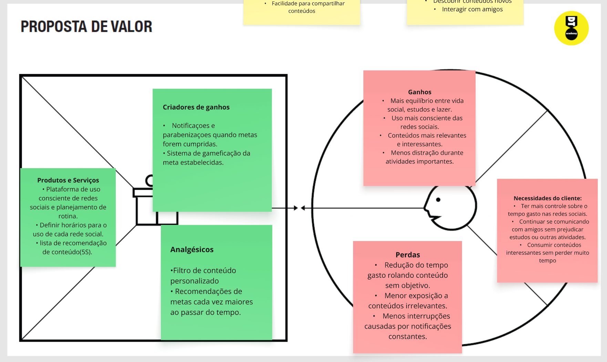
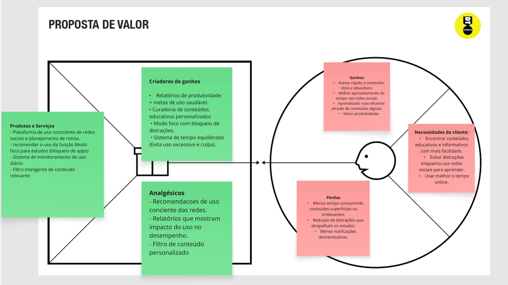
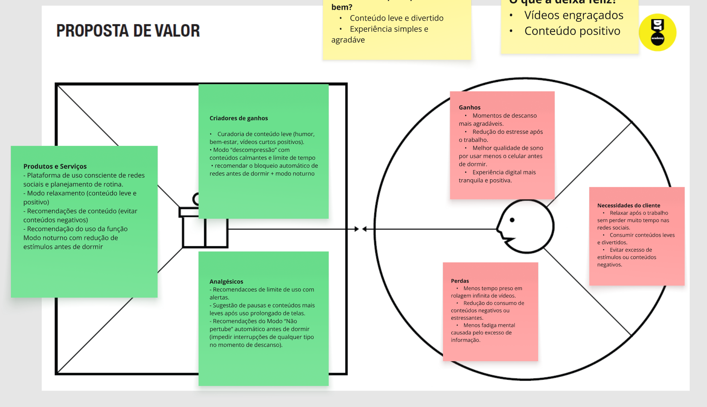

# Product design

Pré-requisitos: <a href="02-Product-discovery.md"> Product discovery</a>

## Histórias de usuários

Com base na análise das personas, foram identificadas as seguintes histórias de usuários:

|EU COMO... `PERSONA`| QUERO/PRECISO ... `FUNCIONALIDADE` |PARA ... `MOTIVO/VALOR`                 |
|--------------------|------------------------------------|----------------------------------------|
|Usuário (Mariana) | visualizar quanto tempo passo nas redes sociais | ter consciência do meu uso               |
|Usuário (Lucas) | definir um limite diário de uso | reduzir o tempo gasto nas redes sociais |
|Usuário (Juliana)  | receber alertas quando uso redes sociais por muito tempo    | evitar uso excessivo     |
|Usuário (Mariana)      | visualizar relatórios semanais do meu uso  | analisar meus hábitos |
|Usuário (Lucas)  | reduzir meu tempo de tela       | me dedicar a atividades com maior importância  |
|Usuário (Juliana)     | receber sugestões de pausas      | evitar uso contínuo prolongado |
|Usuário (Mariana)  | desativar notificações de redes sociais em horários específicos      | substituí-los por outras atividades e hobbies mais produtivos             |
|Usuário (Lucas)     | definir metas de redução de uso    | melhorar minha produtividade    |
|Usuário (Juliana)  | desativar notificações de redes sociais em horários específicos| evitar distrações         |
|Usuário (Mariana)    | ativar um "modo foco"  | minimizar distrações enquanto realizo tarefas (estudo/tarefas/trabalho) |
|Usuário (Lucas) | registrar minhas tarefas realizadas    |  avaliar e analisar meu progresso   |
|Administrador       | visualizar dados agregados de uso | entender o comportamento geral dos usuários do sistema |

## Proposta de valor

**✳️✳️✳️ APRESENTE O DIAGRAMA DA PROPOSTA DE VALOR PARA CADA PERSONA ✳️✳️✳️**

##### Proposta para a persona Mariana

##### Proposta para a persona Lucas Oliveira

##### Proposta para a persona Juliana

## Requisitos

As tabelas a seguir apresentam os requisitos funcionais e não funcionais que detalham o escopo do projeto. Para determinar a prioridade dos requisitos, aplique uma técnica de priorização e detalhe como essa técnica foi aplicada.

### Requisitos funcionais

| ID     | Descrição do Requisito                                   | Prioridade |
| ------ | ---------------------------------------------------------- | ---------- |
| RF-001 | Permitir que o usuário cadastre tarefas ⚠️ EXEMPLO ⚠️ | ALTA       |
| RF-002 | Emitir um relatório de tarefas no mês ⚠️ EXEMPLO ⚠️ | MÉDIA     |

### Requisitos não funcionais

| ID      | Descrição do Requisito                                                              | Prioridade |
| ------- | ------------------------------------------------------------------------------------- | ---------- |
| RNF-001 | O sistema deve ser responsivo para rodar em dispositivos móveis ⚠️ EXEMPLO ⚠️ | MÉDIA     |
| RNF-002 | Deve processar as requisições do usuário em no máximo 3 segundos ⚠️ EXEMPLO ⚠️          | BAIXA      |

> ⚠️ **APAGUE ESTA PARTE ANTES DE ENTREGAR SEU TRABALHO**
>
> Com base nas histórias de usuários, enumere os requisitos da sua solução. Classifique esses requisitos em dois grupos:

- [Requisitos funcionais
 (RF)](https://pt.wikipedia.org/wiki/Requisito_funcional):
 correspondem a uma funcionalidade que deve estar presente na
  plataforma (ex: cadastro de usuário).
- [Requisitos não funcionais
  (RNF)](https://pt.wikipedia.org/wiki/Requisito_n%C3%A3o_funcional):
  correspondem a uma característica técnica, seja de usabilidade,
  desempenho, confiabilidade, segurança ou outro (ex: suporte a
  dispositivos iOS e Android).

Lembre-se de que cada requisito deve corresponder a uma e somente uma característica-alvo da sua solução. Além disso, certifique-se de que todos os aspectos capturados nas histórias de usuários foram cobertos.

> **Links úteis**:
> - [O que são requisitos funcionais e requisitos não funcionais?](https://codificar.com.br/requisitos-funcionais-nao-funcionais/)
> - [Entenda o que são requisitos de software, a diferença entre requisito funcional e não funcional, e como identificar e documentar cada um deles](https://analisederequisitos.com.br/requisitos-funcionais-e-requisitos-nao-funcionais-o-que-sao/)

## Restrições

Enumere as restrições à sua solução. Lembre-se de que as restrições geralmente limitam a solução candidata.

O projeto está restrito aos itens apresentados na tabela a seguir.

|ID| Restrição                                             |
|--|-------------------------------------------------------|
|001| O projeto deverá ser entregue até o final do semestre ⚠️ EXEMPLO ⚠️ |
|002| Não é permitido o desenvolvimento de um módulo de back-end  ⚠️ EXEMPLO ⚠️  |