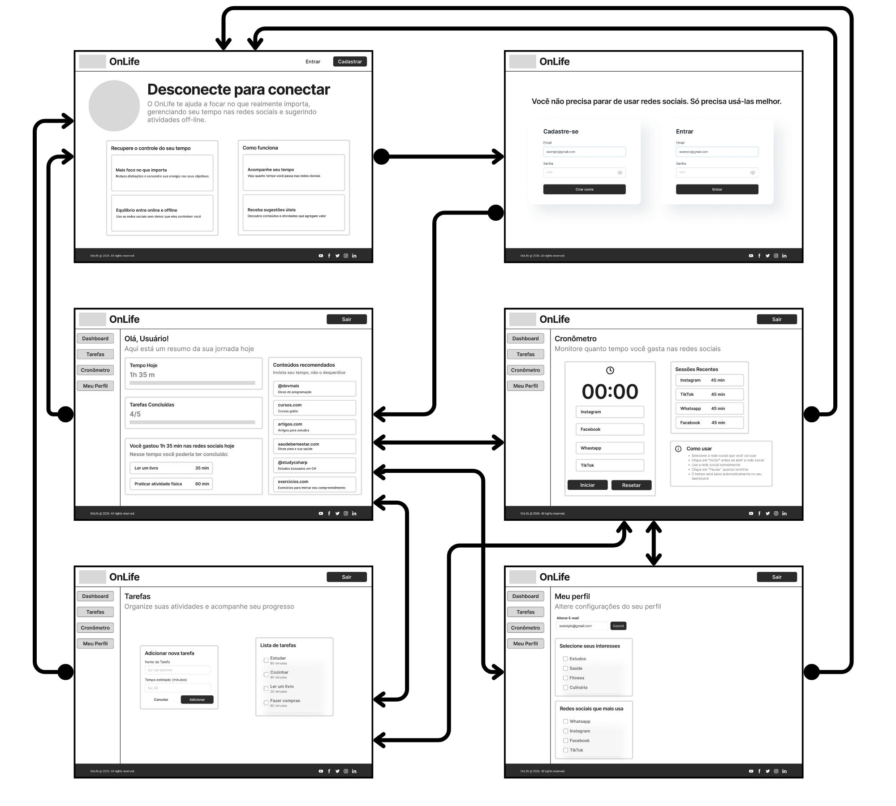
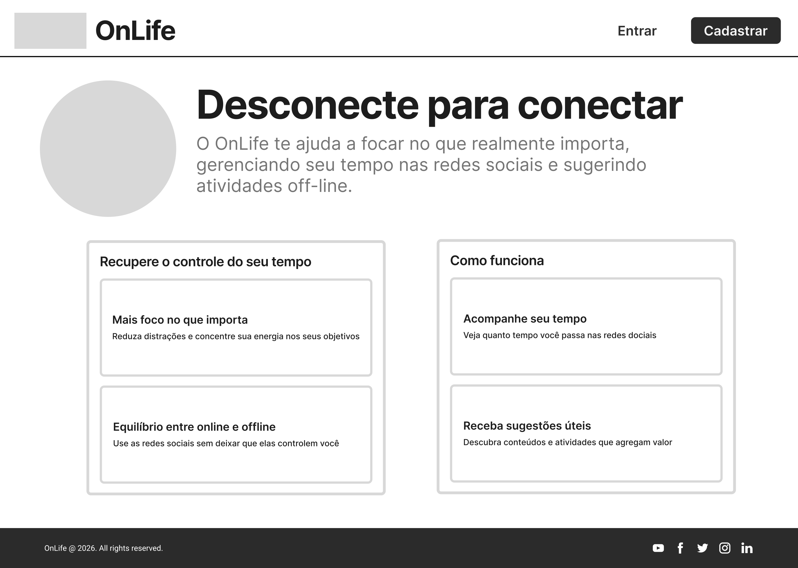
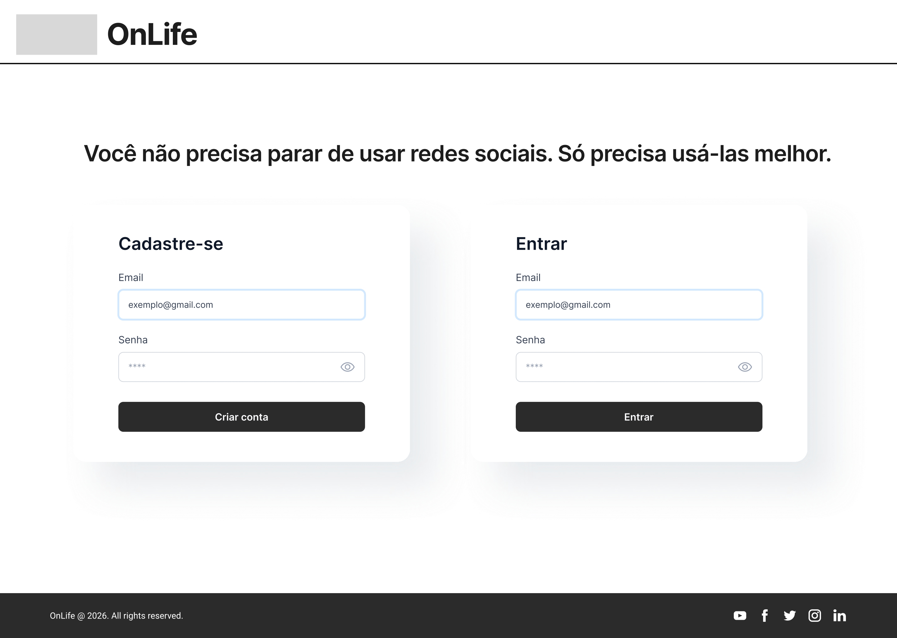
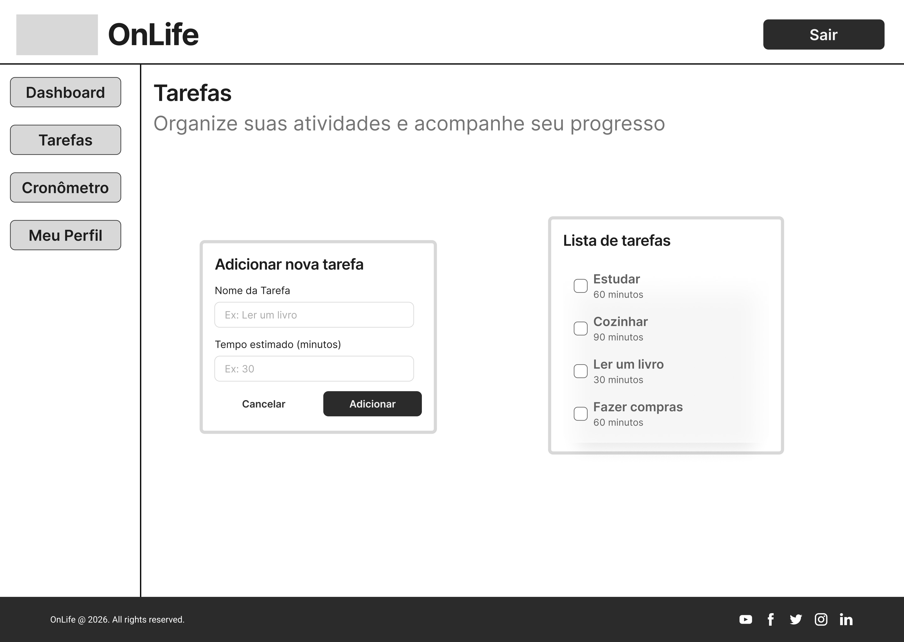
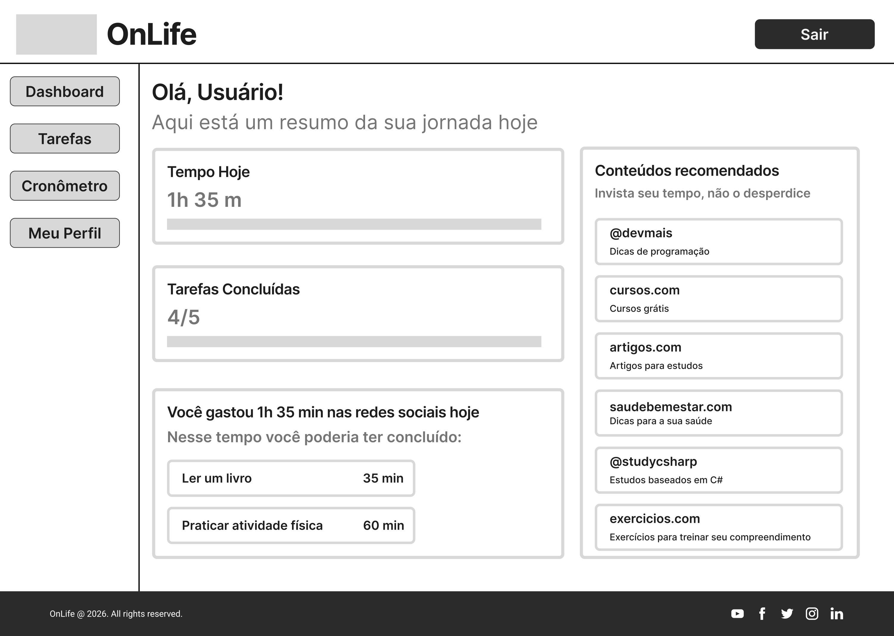
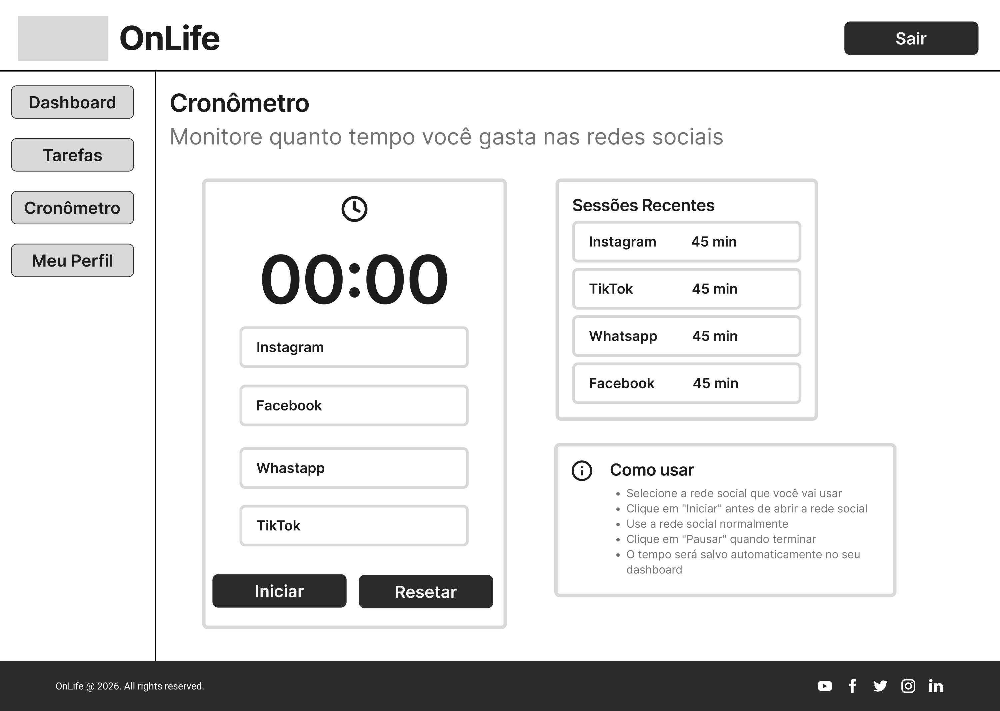

# Projeto de interface

Pré-requisitos: <a href="03-Product-design.md"> product design</a>

 Visão geral da interação do usuário pelas telas do sistema e protótipo interativo das telas com as funcionalidades que fazem parte do sistema (wireframes).

 Apresente as principais interfaces da plataforma. Discuta como ela foi elaborada de forma a atender os requisitos funcionais, não funcionais e histórias de usuário abordados na parte de <a href="03-Product-design.md"> product design</a>.

 ## User flow

## Wireframes

##### TELA - Home

Tela inicial (home)

##### TELA - Entrar/Cadastrar

Tela entrar/cadastrar

##### TELA - Perfil

Tela de perfil

##### TELA - Tarefas

Tela de tarefas

##### TELA - Dashboard

Tela Dashboard

##### TELA - Cronômetro

Tela de Cronômetro

 

### Protótipo Interativo

✅ [Protótipo interativo](https://marvelapp.com/prototype/d2d3151
)  Protótipo Interativo - OnLife